# Vehicle Detection

The main goal in this project is to create a software pipeline to detect vehicles automatically in a video

## Results

The following video shows the final results of vehicles being detected:
[!Track 1](output_images/processed_video.mp4)

The goals / steps of this project are the following:

* Perform a Histogram of Oriented Gradients (HOG) feature extraction on a labeled training set of images and train a classifier Linear SVM classifier
* Optionally,  apply a color transform and append binned color features, as well as histograms of color, to a HOG feature vector. 
* Note:  normalize the features and randomize a selection for training and testing.
* Implement a sliding-window technique and use a trained classifier to search for vehicles in images.
* Run the pipeline on a video stream and create a heat map of recurring detections frame by frame to reject outliers and follow detected vehicles.
* Estimate a bounding box for vehicles detected.

## Data

Here are links to the labeled data for [vehicle](https://s3.amazonaws.com/udacity-sdc/Vehicle_Tracking/vehicles.zip) and [non-vehicle](https://s3.amazonaws.com/udacity-sdc/Vehicle_Tracking/non-vehicles.zip) examples to train a classifier.  These example images come from a combination of the [GTI vehicle image database](http://www.gti.ssr.upm.es/data/Vehicle_database.html), the [KITTI vision benchmark suite](http://www.cvlibs.net/datasets/kitti/), and examples extracted from the project video itself.   
You are welcome and encouraged to take advantage of the recently released [Udacity labeled dataset](https://github.com/udacity/self-driving-car/tree/master/annotations) to augment your training data.  

## Source

The project is implemented in two main files:

- [Train Classifier](train_classifier.py) - Feature extraction, PCA for dimension reduction, Grid Search for best model, training classifier and saving the models.
- [Vehicle Detector](vehicle_detector.py) - Use the above trained classifier to detect vehicles
- [Notebook with base workflow](01_HOG_ClassifierTraining.ipynb) - Shows exploratory data analysis, output of HOG, feature extraction, PCA results, training the classifier and results of tests on static images, including sliding window search and bounding boxes

## Report

### Histogram of Gradients (HOG) Features

The code for HOG feature extraction is in `get_hog_features()` in [vehicle_detector.py](vehicle_detector.py)(lines 41-59). 

I first start by reading in all `vehicle` and `non-vehicle` images. Here are some images from the dataset:

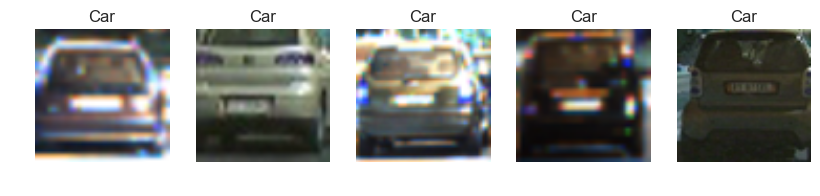
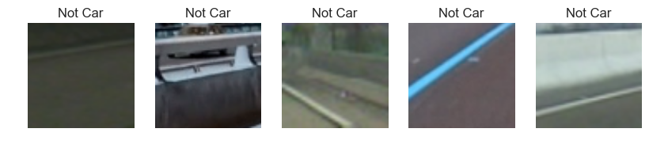

I then explored various color spaces using `skimage.hog()` and parameter combinations of `orientations`, `pixels_per_cell`, and `cell_per_block`. Here is a sample of car and not-car HOG extraction:

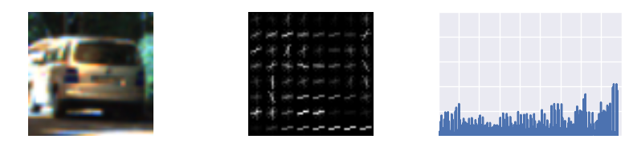
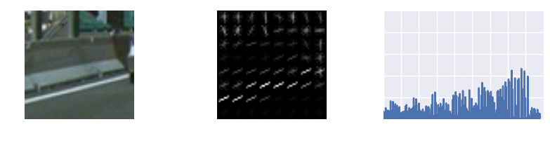

Then using the `YCrCb` color space, I extracted the color histogram of images, as shown:

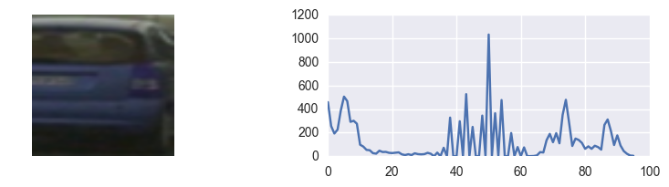
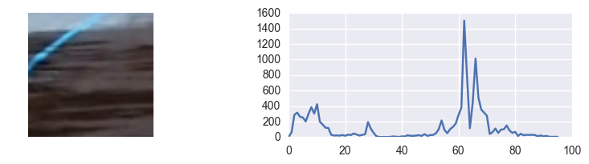

#### Configuration / Feature Extraction

Using various combinations of features, by trail and error, I settled on the following config parameters for feature extraction:

<pre>
### CONFIGURATION: Tweak these parameters and see how the results change.
color_space     = 'YCrCb' # Can be RGB, HSV, LUV, HLS, YUV, YCrCb
orient          = 9  # HOG orientations
pix_per_cell    = 8 # HOG pixels per cell
cell_per_block  = 2 # HOG cells per block
hog_channel     = 'ALL' # Can be 0, 1, 2, or "ALL"
spatial_size    = (32, 32) # Spatial binning dimensions
hist_bins       = 32    # Number of histogram bins
spatial_feat    = True # Spatial features on or off
hist_feat       = True # Histogram features on or off
hog_feat        = True # HOG features on or off
y_start_stop    = [400, 680] # Min and max in y to search in slide_window()
</pre>

Features are extracted using `extract_features()` function in [vehicle_detector.py](vehicle_detector.py) (see lines: 80-130).
The total features extracted were about 8460. Since this is a large number for each image, I experimented with using **Principal Component Analysis (PCA)** for dimensionality reduction. 

### PCA, Grid Search and Training SVM Classifier

I used  `GridSearchCV` from `scikit-learn` library to estimate a well working classifier. The classifers tested were `SVC` with PCA, and a `LinearSVC`. The code for this is implemented in `perform_grid_search()` in [train_classifier.py](train_classifier.py) (see lines: 138-172). PCA code is implemented in `perform_pca()` (lines: 103-136). 

The results of PCA analysis are shown in the [notebook](01_HOG_ClassifierTraining.ipynb).

The results of GridSearch and PCA showed that the best classifier was an SVC `SVC(C=10.0, kernel='rbf', gamma=0.01)` with `n_components=64`, thus reducing our dimension of features from 8460 to 64, a drastic reduction. This resulted in a classifier with **99.38%** accuracy on the test set. 

The model is saved in `MODEL_FILE` and config params in `CONFIG_FILE` defined in `train_classifier.py` for later use by `vehicle_detector.py`.

### Sliding Window Search 

I used the sliding window search algorithm described in the lessons to create a list of windows to search for, and within the windows used the classifier to detect vehicles. The code is implemented in `vehicle_detector.py` in `slide_window()`(lines 132:177) and `search_windows()`(lines 229-290). The system is set to use varying window sizes (80x80 and 96x96) depending on whether we are searching near the horizon or closer. Using smaller window sizes (64x64) results in very large search times especially. The values currently used (80x80 and 96x96) were determined to reduce detection time, while still finding the vehicles optimally. Further tuning might be needed in some cases.

The sliding window output is shown here:

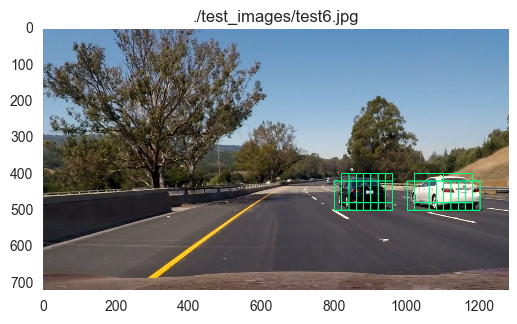
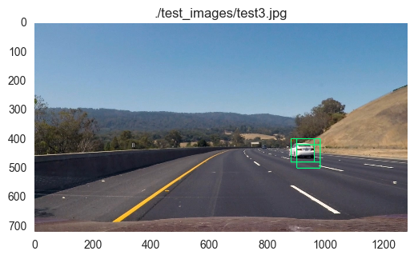

Once a vehicle is detected, we create a heatmap to show where the cars might be. See:

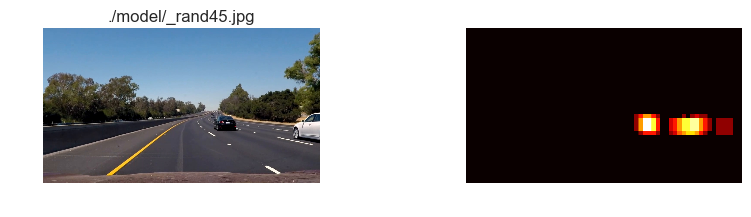
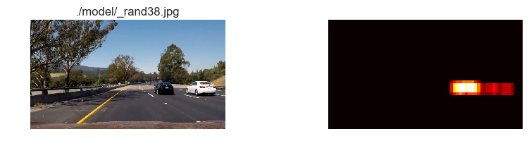

Finally, using a threshold on the heatmaps to remove false positives, we draw bounding box across the car. I experimented with various threshold levels (from 1 to 10), and found that smaller number (1-5) seemed to work best. However, there might still be some (very few) false positives.

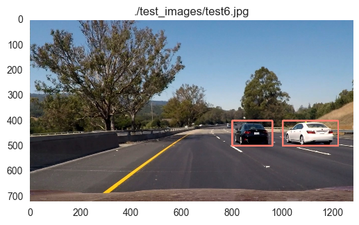
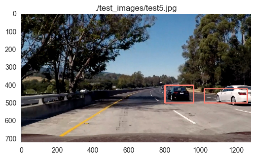
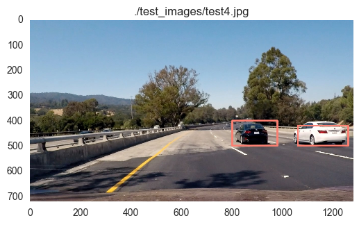

### Video Implementation

To detect vehicles in a video, use the `vehicle_detector.py` with correct values for `MODEL_FILE` and `CONFIG_FILE`. (See lines: 531 onwards). The function `process_frame()` (lines: 424-516) implements the larger algorithm - define windows to search for, detect vehicles, draw boxes, and return each frame of the video. 

The resulting video is here:
[!Track 1](output_images/processed_video.mp4)

### Discussion

This project was a complicated one chiefly due to two reasons: extracting correct features, and detecting vehicles. Both of these larger steps had several smaller steps that had to be optimized - defining the config params to extract features, finding the best classifier, and repeat. Then detecting vehicles also required going back to extracting more/different features and then testing out again on both static images and video. Perhaps most of the time was spent on defining correct window sizes, heat map threshold combination to detect images, but not find false positives.

There might still be some (small) false positives in the video. 

Perhaps a better alternative would be to use Deep Learning techniques like Single-Shot Detector or YOLO for object detection. This could be experimented.

